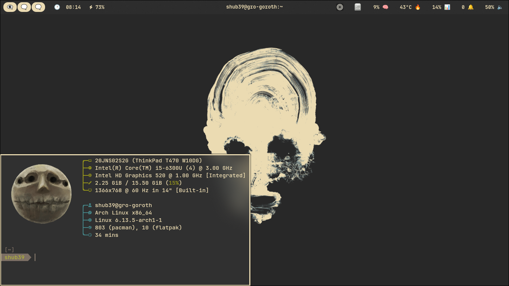
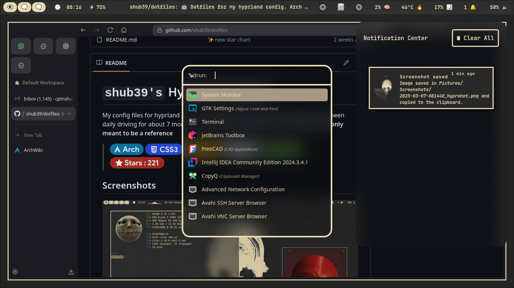
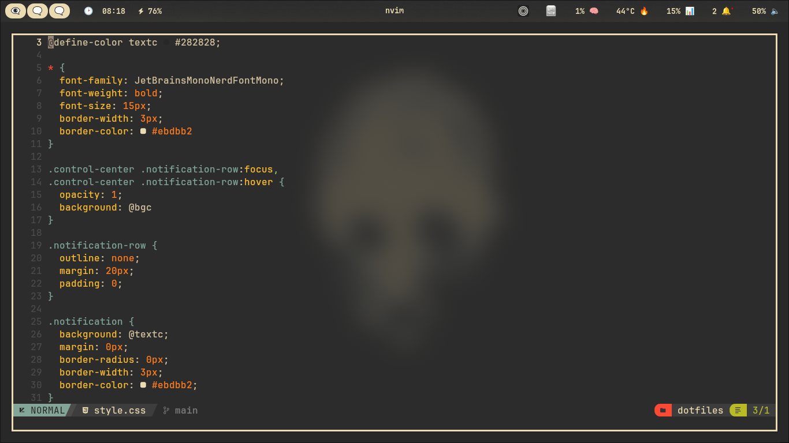
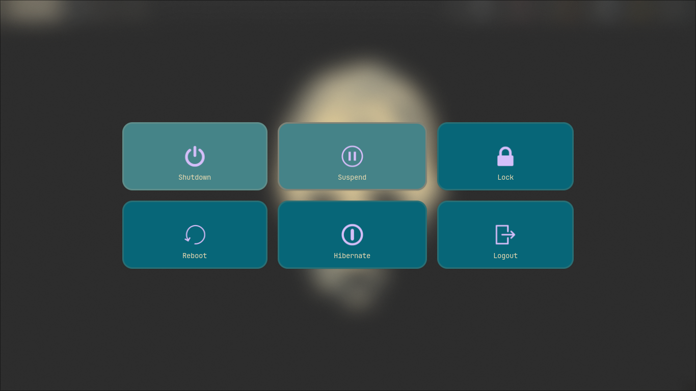

# **`shub39's` Thinkpad T470 Hyprland Dotfiles**

My config files for hyprland and other utilities with some shell scripts that I have been daily driving since `6th March 2025`. **Heavily customised for my workflow and only meant to be a reference**

> 
> 
> 
> 
> 
> 

## Screenshots

## Quick Start
*soon...?*
